# Circadian Analytics Dashboard

Compare Apple Watch and Eight Sleep data exported from HealthKit to analyze sleep timing, HRV, and heart rate discrepancies between devices.

## Architecture

```mermaid
flowchart LR
    subgraph iPhone
        AW[Apple Watch] --> AH[Apple Health]
        ES[Eight Sleep] --> AH
        AH --> AE[Auto Export App]
    end

    subgraph GCP ["GCP (sleep-health-dashboard)"]
        AE -->|POST /healthkit-ingest| CF[Cloud Function]
        CF -->|Write JSON| GCS[(GCS Bucket)]
        GCS -->|Read| CR[Cloud Run]
        CR -->|Streamlit| DB[Dashboard]
    end

    subgraph User
        DB -->|IAP Auth| U[👤 You]
    end
```



## Prerequisites

- **GCP Account** with billing enabled
- **gcloud CLI** installed and authenticated
- **Auto Export app** (~$6 on App Store)
- **Python 3.11+** (for local development)

## Quick Start

### 1. Clone and Setup

```bash
git clone https://github.com/yourusername/circadian-dashboard.git
cd circadian-dashboard
```

### 2. Deploy GCP Infrastructure

```bash
chmod +x infrastructure/setup_gcp.sh
./infrastructure/setup_gcp.sh
```

This will:
- Enable required GCP APIs
- Create GCS bucket for exports
- Generate API key
- Deploy Cloud Function webhook
- Output configuration for Auto Export app

### 3. Configure Auto Export (iPhone)

1. Purchase Auto Export from App Store
2. Open Auto Export → Health Metrics → Enable:
   - Sleep Analysis
   - Heart Rate
   - Heart Rate Variability
   - Respiratory Rate
3. Go to Export Settings → Format: **JSON**
4. Go to Automations → Add daily automation at 6:00 AM
5. Go to Destinations → Add REST API:
   - URL: `[Cloud Function URL from setup]`
   - Method: POST
   - Add Header: `X-API-Key` = `[API Key from setup]`
6. Test the export

### 4. Deploy Dashboard

```bash
chmod +x infrastructure/deploy_cloudrun.sh
./infrastructure/deploy_cloudrun.sh
```

### 5. Enable IAP (Manual)

1. Go to [IAP Console](https://console.cloud.google.com/security/iap)
2. Find `circadian-dashboard` service
3. Toggle IAP ON
4. Add your Google account as `IAP-secured Web App User`

### 6. Access Dashboard

Visit the Cloud Run URL and authenticate with Google.

## Local Development

### Setup

```bash
python -m venv venv
source venv/bin/activate
pip install -r requirements.txt
```

### Run Dashboard Locally

```bash
# Set environment variable for bucket
export GCS_BUCKET=sleep-health-dashboard-healthkit-exports

# Run Streamlit
streamlit run src/dashboard/app.py
```

### Run Tests

```bash
pytest tests/ -v
```

## Project Structure

```
circadian-dashboard/
├── infrastructure/          # GCP setup and deployment scripts
│   ├── setup_gcp.sh        # Initial infrastructure setup
│   └── deploy_cloudrun.sh  # Dashboard deployment
├── cloud_function/          # Webhook for receiving exports
│   ├── main.py
│   └── requirements.txt
├── config/                  # Application configuration
│   └── settings.py
├── src/
│   ├── ingestion/          # HealthKit data loading
│   │   └── healthkit_loader.py
│   ├── analysis/           # Device comparison logic
│   │   └── device_comparator.py
│   └── dashboard/          # Streamlit application
│       └── app.py
├── tests/                   # Test suite
│   ├── test_ingestion.py
│   ├── test_comparator.py
│   └── fixtures/
├── Dockerfile
├── requirements.txt
└── README.md
```

## Features

### Sleep Timing Comparison
- Dual raster plot showing sleep intervals from both devices
- Visual comparison of sleep start, end, and midpoint times
- Duration difference analysis

### Biometric Comparison
- Heart Rate Variability (HRV) trends and correlations
- Resting heart rate comparison
- Device agreement scatter plots

### Agreement Analysis
- Composite agreement score (0-100)
- Flagged nights with large discrepancies
- Trend analysis over time

## Configuration

Edit `config/settings.py` to customize:

- `NIGHT_BOUNDARY_HOUR`: When a "night" starts (default: 6 PM)
- `MIN_SLEEP_DURATION_MINUTES`: Minimum session length (default: 30)
- `DISCREPANCY_THRESHOLD_MINUTES`: Flag threshold (default: 30)
- `LOCAL_TIMEZONE`: Your timezone (default: America/New_York)

## Troubleshooting

### No data showing in dashboard

1. Check Auto Export has synced (test export manually)
2. Verify GCS bucket has files: `gsutil ls gs://sleep-health-dashboard-healthkit-exports/exports/`
3. Check Cloud Function logs: `gcloud functions logs read healthkit-ingest`

### API Key errors

1. Verify header name is exactly `X-API-Key` (case-sensitive)
2. Regenerate key: `openssl rand -hex 16` and update Cloud Function env var

### IAP authentication issues

1. Ensure your Google account is added as IAP-secured Web App User
2. Try incognito window to clear cached credentials
3. Check IAP is enabled for the Cloud Run service

## License

MIT
